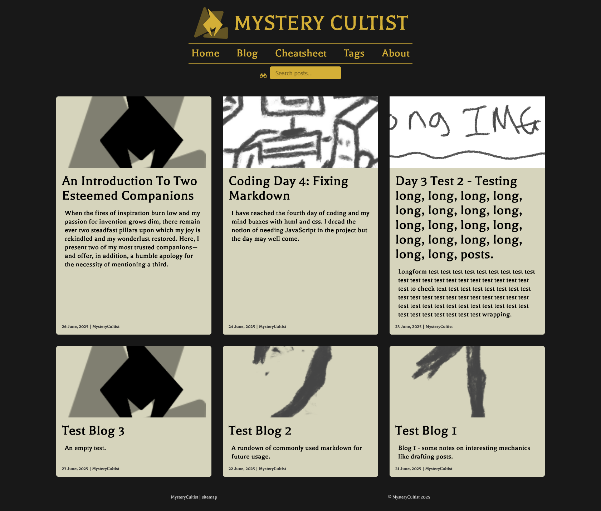
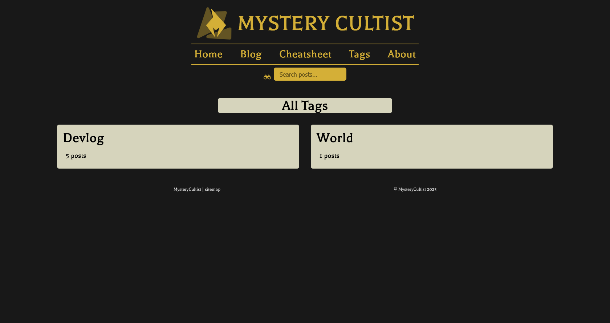

# Tabletop Roleplaying Game Blog
This is my personal blog project, coded from the ground up and hosted via Github Pages on www.mysterycultist.com.

As of 2025-06-27, the web page looks like this and is fully interactable, complete with tag-based searching, good reactivity to screen size and a search feature.

The blog will contain roleplaying game advice from a character known as 'Quin' and it will be a helpful resource for anyone feeling lost in the preparation stages before a session. Furthermore, it will contain a story on the side, as the character of Quin is explored along with a few of his associates.